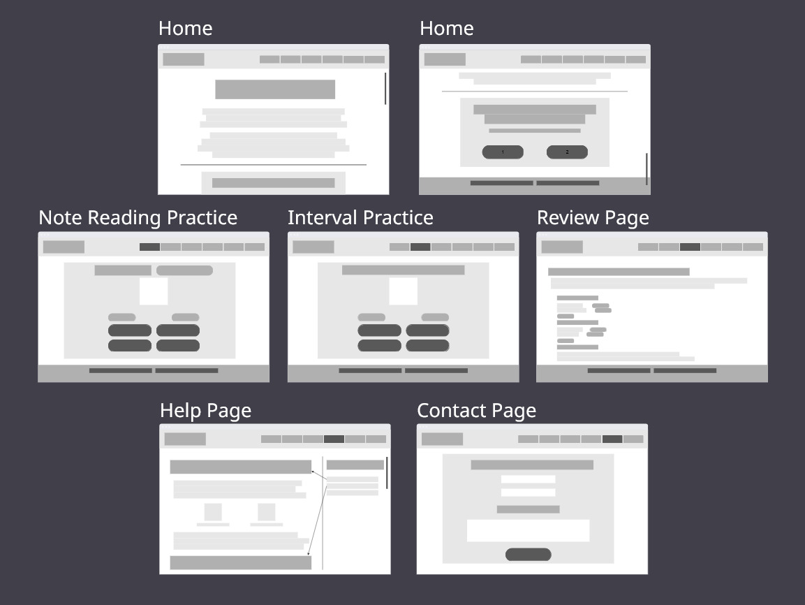
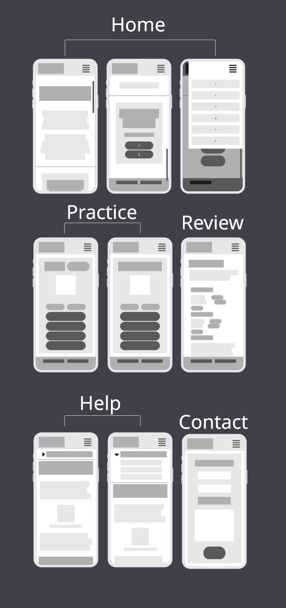
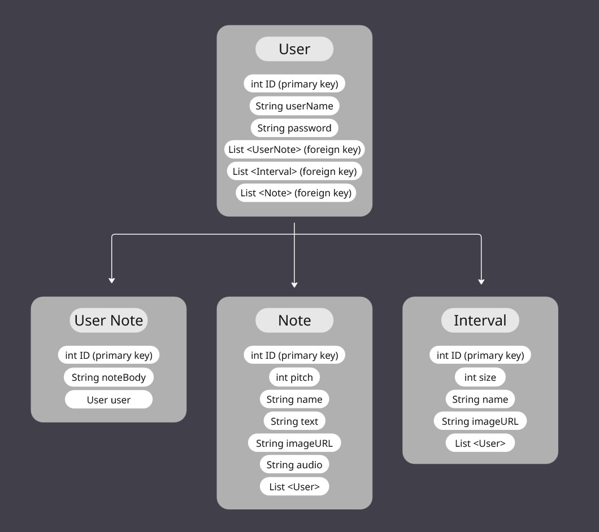

<h2>About This Project</h2>

<strong>Music for Beginners</strong> is an application designed for anyone just starting out in their music learning journey, to help them understand the basics of reading and writing music. While it's aimed at beginners, it can aid anyone looking to strengthen their skills. The front end is built with ReactJS, and the back end is handled by Java Spring boot and a MySQL database. The application currently offers users quizzes on their ability to identify notes and intervals on a staff and add quiz items and personal notes to an account. They can also visit the Help page, for an overview of all of the concepts needed to engage with the practices.

<h2>Technologies Used</h2>
<ul>
  <li><strong>Front End:</strong> JavaScript, HTML, CSS | ReactJS</li>
  <li><strong>Back End:</strong> Java | Spring Boot | MySQL</li>
</ul>

<h2>Installation Instructions</h2>

<strong>Important! Before you begin, ensure you have the following properly installed:</strong>
<ul>
  <li>Node.js</li>
  <li>npm</li>
  <li>Java Development Kit (JDK) 21</li>
  <li>IntelliJ IDEA</li>
  <li>Visual Studio Code</li>
  <li>MySQL Server</li>
  <li>MySQL Workbench</li>
</ul>

<h3>Setting up the Back End</h3>
<ol>
  <li><strong>Clone this project:</strong> Navigate through the terminal to where you'd wish to keep the project. Run this command:
    <pre><code>git clone https://github.com/MostLikelyNotHuman/unit-2-final</code></pre>    
  </li>
  <li><strong>Create database:</strong> Open MySQL Workbench and create a new database named <code>unit-2-final</code></li>
  <li><strong>Set up .env:</strong>Create and configure an .env file at <code>java-spring-boot-back-end-app</code>:
    <pre><code>
      DB_URL=jdbc:mysql://localhost:3306/unit-2-final
      DB_USERNAME=root
      DB_PASSWORD=[your password]
    </code></pre>
  </li>
  <li><strong>Run Java/Spring Boot application:</strong> Open the <code>java-spring-boot-back-end-app</code> folder in IntelliJ, then click run</li>
  <li><strong>Populate database:</strong> Ensure the <code>unit-2-final</code> database is selected, then load and run <code>final-project-sql.sql</code></li>
</ol>

<h3>Setting up the Front End</h3>

<ol>
  <li>Navigate to <code>react-front-end-app</code> or open said folder in VSCode</li>
  <li>Install dependencies with <code>npm install</code> in the terminal</li>
  <li>Run application with <code>npm run dev</code> and visit the app at <code>http://localhost:5173/</code></li>
</ol>

<h2>Digital Wireframes</h2>

<strong>Desktop</strong>

<strong>Mobile</strong>
 

<h2>Entity Relationship Diagram</h2>

<h2>Known Issues</h2>
<ul>
  <li><strong>Image generation in the practice quizzes can lag:</strong> Related to how the images are retrieved when generating questions. Fixes involving pre-loading all images or caching them in the browser are being looked at.</li>
  <li><strong>'Add to Review' button visible even when user is not logged in:</strong> Small fix to add conditional rendering. In progress.</li>
</ul>

<h2>Future Features</h2>
<ul>
  <li><strong>Intervals Review Mode:</strong> Expansion of Review Mode to include the intervals practice. Likely requires creation of special object to store interval review items, rather than linking already existing ones to user account.</li>
  <li><strong>Full Audio Implementation:</strong> Ear training is a key skill for musicians. Looking at ways to add audio to the note and interval quizzes.</li>
  <li><strong>UI Overhaul:</strong> Complete re-theme. Additional Dark Mode. Greater feedback to user interaction like hovering/clicking. Improved responsive design for devices at various sizes. In progress.</li>
  <li><strong>Bass, Alto Clefs:</strong> Additional versions of the note and interval practices that cover the Bass and Alto clefs.</li>
  <li><strong>Rhythm Practice:</strong> Requires completion of full audio implementation. Quiz user with audio sequence, they must select the answer that displays the correct rhythm.</li>
  <li><strong>User Accounts:</strong> Create, update username/password, or delete user accounts. Implementation of JWT verification.</li>
</ul>

